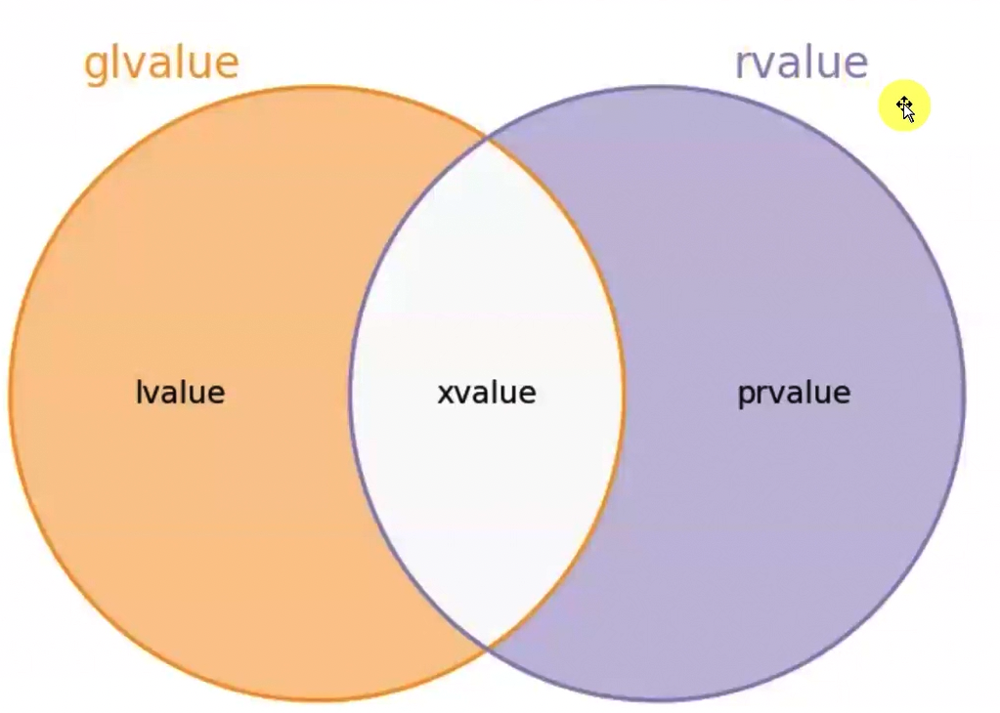
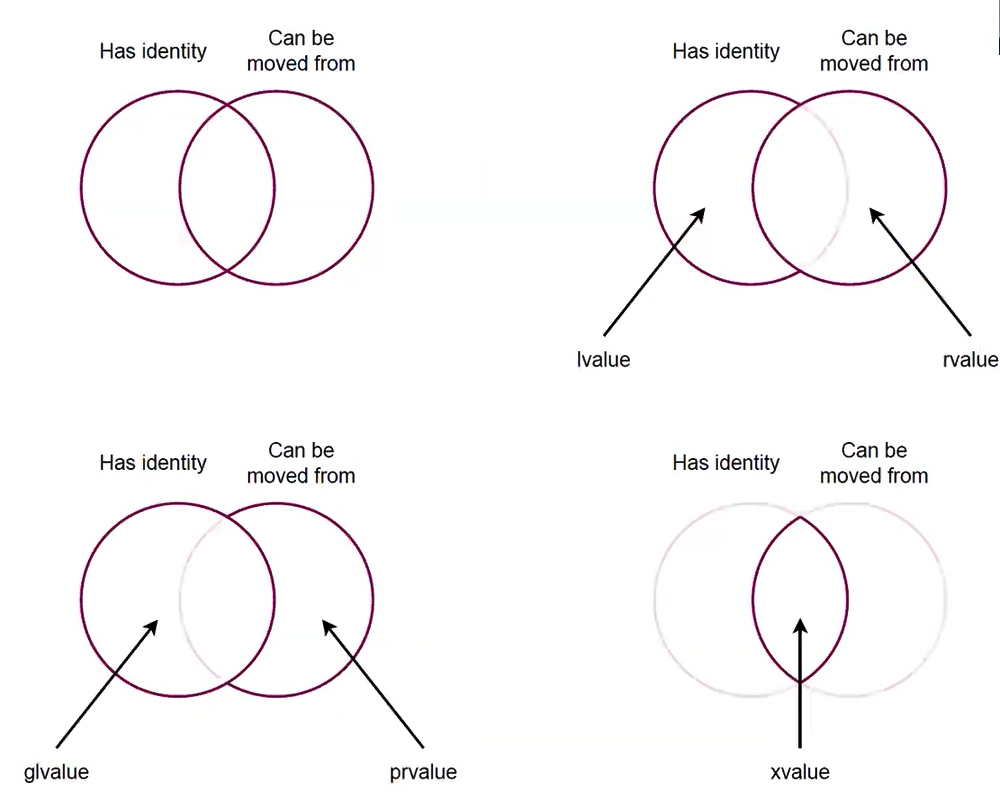

# Tasima Semantigi (Move Semantics)

expression (ifade)

ifadenin turu (data type)
value category of an expression

Value category bir degisken niteligi degildir, bir ifade niteligidir. @00.11 

## Primary Value Category
 - L value (Left Value, Locators Value)
 - PR value (Pure R Value)
 - X value (Expiring Value)

Primary Value Category demekle ne kastediliyor? Bir ifadenin Value Category'si yukaridakilerden biri olmali, ikisi birden olamaz.



## Combined(Mixed) Value Category
- GL value (L value or X value)
- R value  (X value or PR value)



# Referans Kategorileri @00.26

 - L value reference
 - R value reference
 - Forwarding reference (Universal reference)

 ```cpp
 std::string& x = a; // L value reference;
 std::string&& y = std::string{}; // R value reference

 template <typename T>
 void func(T&&) // Forwarding reference
 ```
 Hangi ifadeler hangi category? @00.37
 - Degisken isimlerinin olusturdugu ifadeler her zaman L value.

```cpp
Nec&& r = Nec{};
r; // Value categorysi L value, burada yanilgiya dusulmemeli!

int x = 12;
++x; // L value
x++; // PR value
```
- Geri donus degeri referans turu olan fonksiyon cagri ifadeleri L value.
```cpp
Nec& foo();

foo(); // L value 
```

- Fonksiyon isimleri her zaman L value, `std::move`'a parametre olarak bile gecilse L value.
```cpp
int foo(int);
std::move(foo); // L value
```
- String literallerinin val categorysi L value! @00.46 

- Butun sabitler PR value.
- Sign operator PR value yapar.
```cpp
int x = 10;
+x; // PR value
```

- Lamda ifadeleri gecici nesne olusturdugu icin PR value.
- Non-type template parametreleri fonksiyon tanimi icinde kullanilirsa:
```cpp
template <int N>
void func()
{
    N; // PR value
}

template <int& N>
void func()
{
    N; // L value
}
```

- Bir fonksiyonun geri donus turu referans degilse, ona yapilan cagri ifadesi PR value.
```cpp
int foo();
std::string bar();

foo(); // PR value
bar(); // PR value
```

```cpp
T foo();
T& bar();
T&& baz();

foo(); // PR value
bar(); // L value
baz(); // X value
```

# decltype specifier @01.05
    
- `decltype(isim)`
    Ifade turu direk ismin turu.
- `decltype(expr)`
    Ifadenin value categorysine gore degismekte:
    ```
                expr
    Lvalue      T&
    PRvalue     T
    Xvalue      T &&
    ```

# Function Overload Resolution @01.34

# Forwarding reference @02.05
Burada ikside butun value categoryler icin ve butun constluk durumlari icin viable. Ancak template kullanmanin avantaji fonksiyon icinde parametrenin value categorysini ve constluk durumunu elde edebiliyoruz. X value oldugunu hicbir sekilde anlayamayiz.
 ```cpp
void func (const Nec& r)
{
    //...
}

template <typename T>
void bar(T&&)
{
    //...
}
 ```