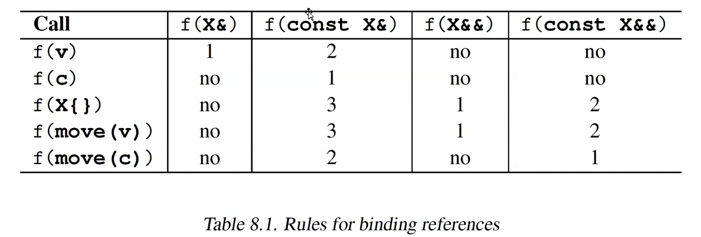

Tasima semantiginin amaci nedir?
Gereksiz kopyalamalarin onune gecmek.

- Tasimanin her zaman bir avantaj saglayacagini dusunmek, yapilan tipik hatalardan biri! @00.05

# <algorithm> baslik dosyasindaki std::move ve std::copy   implementasyonu@00.07

`<algorith>` baslik dosyasindaki move fonksiyonu.
hicbir stl algoritmasi exception throw etmiyor. @00.12

Kendimiz `<utilty>` move func'i nasil yazariz. @00.14 
`std::remove_reference_t`

- Meta Function:  Amaci compile time'da bir deger veya bir tur hesaplamak olan siniflardir.

- Alias Template @ 00.35
- using anahtar sozcuugu ile yapilan tur es isim bildirimi.

 >> Template turleri: Class Template, Function Template, Variable Template, Type Alias Template, Concepts.

 >> Nerde zahmet orada eziyet, ama nerede zahmet orada hata yapma riski!

## Universal reference olma kosullari @00.47
 - Universal reference olmasi icin, type deduction olmasi lazi. Olmadan olmaz.
 - Baska bir niteleyici olmayacak.

Uye fonksiyonun parametresinin Universal Reference olmasini istiyorsak `Member Template` olmasi gerekir.

## Universal Reference Parametrede Template Argument Deduction @00.54

>> !! Universal Reference parametreli fonk kullanmanin, L value reference parametreli fonksiyona gore avantaji; universal olanda argumanin value kategorisini ve const'lugunu retain edebiliyor. (PR value veya X value oldugu sinanamiyor!)

# Reference Collapsing @01.01
```
T&      &       T&
T&      &&      T&
T&&     &       T&
T&&     &&      T&&
```
Reference collapsing olusan durumlar
- Template argument deduction.
- auto&&
- Tur es isim bildirimleri. Type alias.
- decltype

## std::move implementasyonuna geri donus @01.10
>> noexcept specifier ve noexcept operator'u.



>> Bir fonksiyonun geri donus degerini asla non reference const yapmayin! @01.25


# std::move_if_noexcept @01.35

# Special Member Functions


## Special Member Function Acisindan 4 farkli sinif kategorisi:
- copyable && moveable
- copyable not movea ble
- non copyable movable (move-only) std::thread, std::unique_ptr
- non copyable non moveable std::mutex

** Move memberlari asla delete etmeyin, elde edeceginiz bisey yok ama kaybedecek seyler var.

>> default bildirimi sonradan yapilaibliyor, ama delete yapilamiyor! @02.38
```cpp
class Myclass {
    public:
    Myclass();
};

Myclass::Myclass() = default; // Gecerli
// Myclass::Myclass() = delete; // Gecersiz.
```
 
## Reference qualifiers
Cok kisa bahsedildi. @Dersin sonunda.