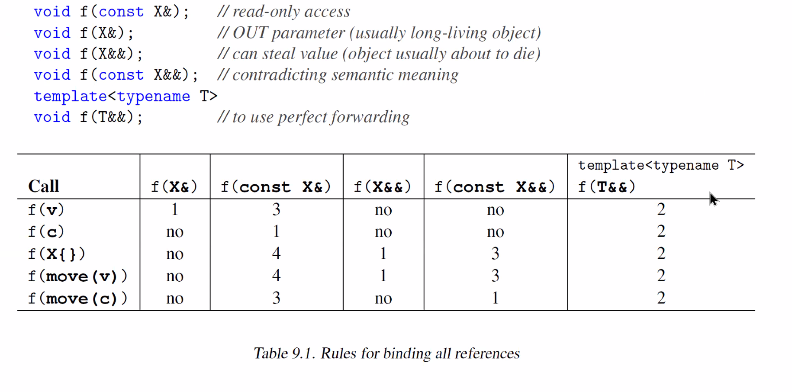

## Perfect Returning

```cpp
auto f = [](auto func, auto&&... args) -> decltype(auto) {
    return func (std: : forward<decltype(args)>(args) ...);
    };
```
- Defered


Duzelt!!
```cpp
#include ‹utility›

template ‹ typename ... Args>
void f(Args &&...);

int main()
    auto fn = [](auto f, auto&&... args) -> decltype(auto) {
    decltype(auto) ret = f(std::forward<decltype(args)>(args)...);
    if constexpr (std::is_rvalue_reference_v‹decltype(ret) >) {
        return std::move(ret); // move value returned by f() to the caller
    }
    else {
        return ret; // return the value or the lvalue reference
    }
} ;
```

David Mazieres'in makalesinden sorular.




## Tag Classes (Empty Class)

## User Defined Literals
