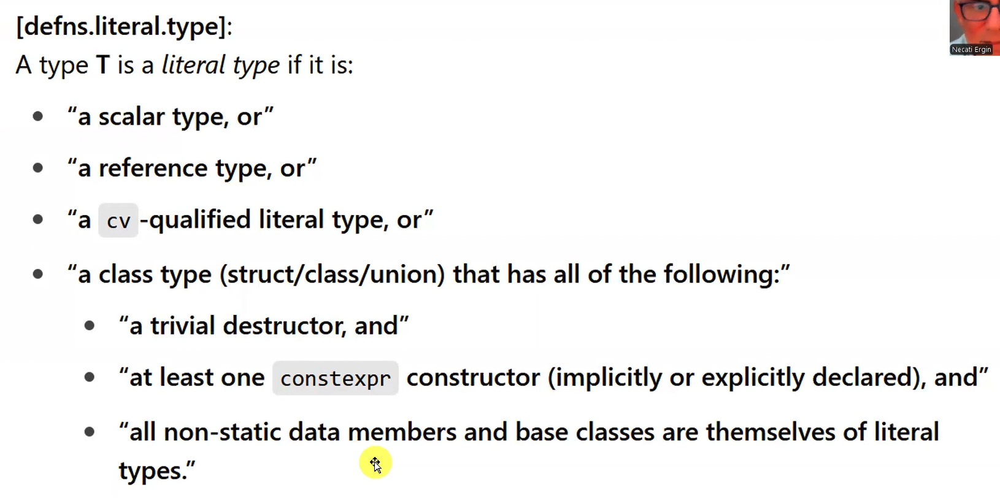

## *TEMPLATE PARAMETERS (Detayli Anlatim)*

- Type Parameter
- Non-Type parameter
- Template Template Parameter

### *Non Type Template Parameter (NTTP)*

> Hocanin *NTTP* yerine tavsiye ettigi isimlendirme *Value Parameter*.

```cpp
template <int>
class Myclass {
    
};
I
int main (){
    Myclass<10>;
}
```

```cpp
template <auto N>
class Myclass {

};
I
int main (){
    Myclass<10>;
}
```

```cpp
template <auto ...N>
class Myclass {

};
I
int main (){
    Myclass<10, 20u, 45L, 3.4>;
}
```

> *NTTP*'nin alabilecegi turler:
> - Tam sayi turleri
> - Enumaration turleri
> - Object pointer turleri
> - Data member pointer types
> - function pointer types
> - member function pointer types
> - reference types
> - floating types (C++20)
> - literal types (C++20)

```cpp
class Myclass {
public:
  double foo(double);
};

int foo(int);

int g{};

template <std::nullptr_t>
class x {};

template <int x>
class A {};

template <int* p> // Arguman kesinlikle static omurlu bir degisken adresi olmak zorunda!
class B {};

template <int (*pf) (int)>
class C {};

template <double (Myclass::*)(double)> // Member function pointer type.
class D {};

template <int& x>
class E {};

constexpr int baz(int i)
{
  return 42 + i;
}

int bar(int i)
{
  return 42 + i;
}

int main()
{
    /* 
        Arguman ifadelerinin, sabit ifadesi olmasi gerekiyor.
    */
  static int ival { 42 };
  const int i = 6;
  int x = 5;
  [[maybe_unused]] A<5> ax1;
  [[maybe_unused]] A<i> ax2;
//   [[maybe_unused]] A<x> ax3; // Invalid.
  [[maybe_unused]] A<baz(12)> ax4;
//   [[maybe_unused]] A<bar(12)> ax5; Invalid.
  [[maybe_unused]] B<&g> bx1;
//   [[maybe_unused]] B<&x> bx2; // Invalid.
  [[maybe_unused]] B<&ival> bx2;
  [[maybe_unused]] C<foo> cx1;
  C <+[](int x) {return x + 1; }> c2; // Positive labmda gecerli, normal lambda da gecerli olabilir emin degiliz.
  [[maybe_unused]] D<&Myclass::foo> dx;
  [[maybe_unused]] E<g> ex1;
  [[maybe_unused]] E<ival> ex2;
  //...
}
```

```cpp
struct Nec
{
  int foo(int);
  int mx;
};

template <int Nec::* ip, int (Nec::* fp) (int)>
class C {

};

int main()
{
  C<&Nec::mx, &Nec::foo> cx;
  //...
}
```

```cpp
template <int x, bool b>
class Nec {};

int main()
{
    Nec<10, true> n1;
    Nec<sizeof(int), sizeof(int) == 4> n2;
    //Nec<5, sizeof(int) > 2> n3; //Invalid: Burada hata parsing hatasi, operator >; kapanan acisal parantez olarak algilaniyor.
    Nec<5, (sizeof(int) > 2) > n4; //valid
}
```

```cpp
#include <vector>
#include <algorithm>

template<typename T, int val>
T add_value(T x)
{
  return x + val;
}

int main()
{
  std:: vector<int> source (100);
  std:: vector<int> dest (100);
  transform(begin(source), end(source), begin(dest), add_value<int, 10>);
  transform(begin (source), end (source), begin(dest), [](int x) {return x + 10; }) ;
}
```

```cpp
template<typename T, int N, int M>
constexpr bool less(const T(&a)[N], const T(&b)[M])
{
	for (int i = 0; i < N && i < M; ++i)
	{
		if (a[i] < b[i])
			return true;

		if (b[i] < a[i])
			return false;
	}

	return N < M;
}

int main()
{
	constexpr int a[] = { 3, 7, 9 };
	constexpr int b[] = { 3, 7, 9, 2, 6 };
	constexpr int c[] = { 3, 7, 9, 3, 6 };

	constexpr auto result1 = less(b, c);
	constexpr auto result2 = less(a, c);
}
```

```cpp
// dizinin elemanlarin yazdiracak
template <typename T, std::size_t SIZE>
std::ostream& operator<<(std::ostream& os, const std: :array<T, SIZE>& ar);
```
@00:42
```cpp
template <auto VAL, typename T = decltype(VAL)>
T foo() ;

int main()
{
    Foo<5>()
}
```

```cpp
template <typename T, T x>
struct IntegralConstant {}

int main()
{
    IntegralConstant<int, 5>
}
```

```cpp
#include <type_traits>

template <typename T>
struct IsPointer : std::false_type{

};

template <typename T>
struct IsPointer<T*> : std::true_type {

};
```

```cpp
template <int N, int& r>
void bar()
{
	//++N; // error
	++r; // OK
	//auto p1 = &N; // error
	auto p2 = &r; // OK
	//int& r1 = N; // error
	int& r2 = r; // OK
	//...
}

int g{};

int main()
{
	bar<2, g>();
}
```

```cpp
template <auto x, auto y>
struct Sum {
	auto static constexpr value = x + y;
};

int main()
{
	constexpr auto x = Sum<12, 4L>::value;
	constexpr auto y = Sum<5, 6U>::value;
}
```

```cpp
#include <iostream›

template < const char* p>
void func()
{
    std::cout < p << '\n';
}

char std[] = "necati";

int main()
{
    // func<"necati">(); // Invalid.
    func<str>(); // Invalid.
}
```

```cpp
#include <algorithm>
#include <iostream>

template<int N>
struct StrLiteral {
    constexpr StrLiteral(const char (&str)[N]) 
    {
        std::copy(str, str + N, s);
    }
    char s[N];
};

template<StrLiteral str>
struct Nec{
    Nec()
    {
        std::cout << str.s << '\n';
    }
};

template<StrLiteral str>
void foo() 
{
    std::cout << str.s << '\n';
}

int main() 
{
    Nec<"necati ergin"> nx;
    foo<"string literal">();
}
```
@01:08

https://ctrpeach.io/posts/cpp20-class-as-non-type-template-param/

```cpp
#include <iostream>

struct NullOptT {} NullOpt;

/**
 * Literal class type.
 *
 * Represents an optionally provided `int`.
 */

struct OptionalInt {
    constexpr OptionalInt(NullOptT) {}
    constexpr OptionalInt(int value) : has_value(true), value(value) {}

    const bool has_value = false;
    const uint32_t value{};
};

/**
 * Prints whether or not a value was provided for "maybe" WITHOUT branching :)
 */
template<OptionalInt maybe>
void Print() {
    if constexpr (maybe.has_value) {
        std::cout << "Value is: " << maybe.value << std::endl;
    }
    else {
        std::cout << "No value." << std::endl;
    }
}

// Note: implicit conversions are at play!
int main()
{
    Print<123>();     // Prints "Value is: 123"
    Print<NullOpt>(); // Prints "No value."
}
```

@01:11

#### *LITERAL TYPE*



> - Bir tur ya *Literal Type*'tir ya da degildir.
> - "a cv -qualified literal type, or": Diyelim ki `myclass` bir literal type. O zaman `const myclass`, `volatile myclass`, `const volatile myclass` turleri de *Literal Type* olur.
> - "a trivial destructor": Hicbirsey yapmayan, derleyici tarafindan yazilan dtor'u olacak.

```cpp
#include <iostream>

struct Nec {
  int x, y;
};

template <Nec nec>
class Myclass {
public:
  Myclass ()
  {
    std:: cout << nec.x << nec.y;
  }
};
int main()
{
  Myclass <Nec { 3, 6 } > x;
}
```

```cpp
template<auto x>
class Myclass {
	//...
};

int main()
{
	Myclass<std::pair<int, double>{10, 4.5 }> x;
	
}
```

```cpp
template<auto x>
class Myclass {
	//...
};

int main()
{
  /* 
   Capture olmayan lambda ifadeleri literal type.
  */
	Myclass< [] (int x) { return x * x; }> m1;	
}
```

@01:20

```cpp
// Her defasinda farkli bir tur olusmasi icin boyle bir kod yazilabilir.
template ‹auto = []{} >
class Myclass {
};

int main()
{
  Myclass<> m1;
  Myclass<> m2;
  
  // m1 = m2; // Invalid. Cunku m1 ve m2 iki farkli tur. Ozdes lamda ifadeleri farkli closure type olusturur.
}
```

```cpp
#include <array>
#include <utility>

template<auto X>
class Nec {
	//...
};

int main()
{
	Nec<std::pair{10, 4.5 }> n1; // valid since C++20
	Nec<std::array{2, 3, 5, 7, 11, 13} > n2; // valid since C++20
}
```

```cpp
#include <iostream>
#include <array>

constexpr int foo()
{
  return 42;
}

struct Lit {
  int x = foo();        // OK because foo() is constexpr
  int y;
  constexpr Lit(int i)  // OK because constexpr
   : y{i} {
  }
};

// Aggregate type'larda ctor dogrudan var kabul ediliyor.

struct Data {
  int i;
  std::array<double,5> vals;
  Lit lit;
};

template<auto Obj>
void func()
{
  std::cout << typeid(Obj).name() << '\n';
}

int main()
{
  func<Data{42, {1, 2, 3}, 42}>();    // OK

  constexpr Data d2{1, {2}, 3};
  func<d2>();   
}
```

```cpp
#include <iostream>
#include <cmath>

struct Vat {
    double val;

    constexpr Vat(double v) : val{ v } {}

    friend std::ostream& operator<< (std::ostream& oss, const Vat& vat)
    {
        return oss << vat.val;
    }
};

template<Vat vat>
int add_vat(int val)
{
    return static_cast<int>(std::round(val * (1 + vat.val)));
}

int main()
{
    constexpr Vat v{ 0.2 };
    std::cout << "vat: " << v<< '\n';

    std::cout << add_vat<v>(45) << '\n';
    std::cout << add_vat<v>(317) << '\n';
    std::cout << add_vat < Vat{ 0.08 } >(4512) << '\n';
}
```

```cpp
template <auto F>
struct ValueWrapper {
    static constexpr auto value = F(42);
};

constexpr auto fl = [](int x) { return x + 1; };

using Wrapped = ValueWrapper<fl>;  // OK in C++20

static_assert(Wrapped::value == 43);
```

---

@01:36

## *VARIABLE TEMPLATE* (Since C++14)

> Bir variable olusturan template.
>
> - N tane template parametresi alabilir.
> - Type Parameter, NTTP, Template Parameter olabilir.
> - Explicit ve Partial Specialization olusturulabilir.

```cpp
//source: cppreference.com

/* 
pi'in kendisi bir degisken degil, specialization'lari birer degisken.
*/

template<class T>
constexpr T pi = T(3.1415926535897932385L);  // variable template

template<class T>
T circular_area(T r) // function template
{
	return pi<T> * r * r; // pi<T> is a variable template instantiation
}
```

> *Variable Template*'in kullanildigi tipik yerlerden biri, *TMP*'de *compile time recursivity* ile deger hesaplatma kodlari.

```cpp
#include <cstddef>

template<size_t n>
constexpr size_t fact{ n * fact<n - 1> };

template<>
constexpr size_t fact<0>{1};

int main()
{
	static_assert(fact<5> == 120);
}
```

```cpp
template<size_t base, size_t exp>
constexpr size_t power = base * power<base, exp - 1>;

template<size_t base>
constexpr size_t power<base, 0> = 1;

template<size_t base>
constexpr size_t power<base, 1> = base;

int main()
{
	static_assert(power<2, 0> == 1);
	static_assert(power<7, 3> == 343);
	static_assert(power<2, 10> == 1024);
}
```

> *Variable Template*'in kullanildigi baska bir tipik yer ise *type_traits* kutuphanesi. `::value` ile deger donduren her bir *meta-function* icin `_v` ile biten bir *variable template* var.

```cpp
#include <type_traits>

template <typename T>
struct IsReference : std::false_type {};

template <typename T>
struct IsReference <T&> : std::true_type {};

template <typename T>
constexpr bool IsReference_v = IsReference<T>::value;

int main()
{
  IsReference_v<int&>;
}
```

```cpp
#include <iostream>

template <int ...Vals>
constexpr int int_ar[] = { Vals... };

int main()
{
	constexpr auto val = int_ar<1, 3, 5, 7>[2]; //val = 5

	for (auto x : int_ar<10, 20, 30, 40>)
		std::cout << x << ' ';
}
```

```cpp
template <auto N>
constexpr bool is_positive{ N > 0 };

class Wrapper {
public:
	constexpr Wrapper(int x) :mx{x} {}
	constexpr bool operator>(const Wrapper other)const
	{
		return mx > other.mx;
	}
	int mx;
};

int main()
{
	boolalpha(std::cout);

	std::cout << is_positive<4> << '\n';
	std::cout << is_positive<-5> << '\n';
	std::cout << is_positive<4.5> << '\n';
	std::cout << is_positive<-5L> << '\n';
	std::cout << is_positive<Wrapper{3}> << '\n';
	std::cout << is_positive<Wrapper{-2}> << '\n';
}
```

```cpp
#include <iostream>

/* 
  Unary left fold ifade.
*/

template <int... Vals>
constexpr int Sum = (... + Vals);

template <int... Vals>
constexpr int SumSquare = (... + (Vals * Vals));

int main()
{
	std::cout << Sum<1> << '\n';
	std::cout << Sum<1, 2> << '\n';
	std::cout << Sum<1, 34, 65> << '\n';
	std::cout << SumSquare<1, 3, 5, 7> << '\n';
}
```

> Bir template namespace icinde tanimlanmali. Bir blok icinde (orn: fonksiyon) template olusturulamaz. Bunun istisnasi lambda ifadeleri bir blok icinde olabilir. Dolayisiyla bir *template variable*'in otomatik omurlu olmasi soz konusu degil, statik omurlu degisken olabilir.

```cpp
#include <cstddef>

template <size_t VAL>
constexpr size_t set_bit_count = (VAL % 2) + set_bit_count<(VAL / 2)>;

template <>
constexpr size_t set_bit_count<0> = 0;

static_assert(set_bit_count<15> == 4);
static_assert(set_bit_count<19> == 3);
```

```cpp
template<typename... Args>
constexpr bool tflags = true;

int main()
{
	static_assert(tflags<>);
	static_assert(tflags<int>);
	static_assert(tflags<int, double>);
	static_assert(tflags<int, int, int>);
}
```

```cpp
#include <type_traits>

template<typename... Ts>
constexpr bool are_all_int = (std::is_same_v<Ts, int> && ...);

/* 
  Unary right fold over logical and operator.
*/

int main() 
{
    static_assert(are_all_int<int, int, int>);       // true
    static_assert(!are_all_int<int, double, int>);   // false
}
```

```cpp
template<int... Ns>
constexpr bool all_positive = ((Ns > 0) && ...);

int main() 
{
    static_assert(all_positive<1, 2, 3, 4>);   // true
    static_assert(!all_positive<1, -2, 3>);    // false
}
```

```cpp
#include <cstddef>

template<typename... Ts>
constexpr std::size_t num_types = sizeof...(Ts);

/* 
  Burada kullanilan bildigimiz `sizeof` operatoru degil,
  variadic bicimi. Paketteki oge sayisini dondurur.
*/

static_assert(num_types<> == 0);
static_assert(num_types<int, double> == 2);
static_assert(num_types<char, bool, float, int> == 4);
```

```cpp
#include <type_traits>

template<typename... Ts>
using common_type_t = typename std::common_type<Ts...>::type;

template<typename... Ts>
constexpr bool has_common_type = !std::is_void_v<common_type_t<Ts...>>;

static_assert(std::is_same_v<common_type_t<int, double>, double>);
static_assert(has_common_type<int, float, double>);
```

@02:09

```cpp
#include <iostream>

template<typename T>
constexpr std::size_t SZ = sizeof(T);

template<>
constexpr sta::size_t SZ<void> = 0;

/* 
  Burada void icin neden boyle bisey yapilmis?
  `void` turu incomplete type oldugu icin sizeof
  operatorunun operandi olamaz. sizeof operatorunun
  operandi complete type olmak zorunda.
*/

int main()
{
  std:: cout << SZ<double> << '\n';
  std:: cout << SZ<void> << '\n'
}
```

> Template complete type olmak zorunda degil. Faydasi herhangi bir acilim icin, yalnizca explicit veya partial specialization olusturulursa kullanilabilir olmasi.

```cpp
template <typename T>
class Myclass;

template <>
class Myclass <int> {};
template <>
class Myclass <double> {};
template <>
class Myclass <char> {};
```

```cpp
#include<cstddef>

class X{};
class Y{};
class Z{};

template <typename T>
struct Nec;

template <>
struct Nec<X> {
	constexpr static std::size_t value = 1;
};


template <>
struct Nec<Y> {
	constexpr static std::size_t value = 2;
};

template <>
struct Nec<Z> {
	constexpr static std::size_t value = 3;
};


template <typename T>
constexpr std::size_t Nec_v = Nec<T>::value;

int main()
{
	constexpr auto val_1 = Nec_v<X>;  	//1u
	constexpr auto val_2 = Nec_v<Y>;  	//2u
	constexpr auto val_3 = Nec_v<Z>;    //3u 
}
```

> Hoca yukaridaki kod yerine asagidakini tercih ederim diyor. Cunku, diger ogeleri de kullanabiliyor.
> .type, .value vs.

```cpp
#include<cstddef>

class X{};
class Y{};
class Z{};

template <typename T>
struct Nec;

template <>
struct Nec<X> : std::integral_constat<size_t, 1u> {};

template <>
struct Nec<Y> : std::integral_constat<size_t, 2u> {};

template <>
struct Nec<Z> : std::integral_constat<size_t, 3u> {};


template <typename T>
constexpr std::size_t Nec_v = Nec<T>::value;

int main()
{
	constexpr auto val_1 = Nec_v<X>;  	//1u
	constexpr auto val_2 = Nec_v<Y>;  	//2u
	constexpr auto val_3 = Nec_v<Z>;    //3u 
}
```

```cpp
template <typename T>
constexpr bool ispointer = false;

template <typename T>
constexpr bool ispointer<T*> = true;

int main()
{
  ispointer<int*>;
}
```

@02:22

> Degiskenin adresi kullanilmadigi surece, yani degisken icin bir storage ayrilmasina neden
> olacak bir kod yazilmadikca; *Variable Template*'ler bellekte bir yer kaplamiyor. Bunun *Variable
> Template* olmasiyla alakasi yok.

@02:21

## *ALIAS TEMPLATE* (Since C++11)

> `typedef` bildiriminin gecerliligi devam ediyor. Cok ozel bir neden olmadikca `using` yerine
> `typedef` kullanilmaz. Sebepler:
> - Kullanimi cok daha kolay.
> - `typedef` kullanimi template haline getirilemiyor.

```cpp
template <typename T>
using vec = std::vector<T>;

int main()
{
  vec<int>;
}
```

```cpp
template <typename T>
using ptr = T*;

int main()
{
  ptr<int>;
}
```

```cpp
template <typename T, size_t SIZE>
using arr = T[SIZE];

int main()
{
  arr<int, 5> x, y, z;
}
```

```cpp
template <typename T>
using arr4 = T[4];

int main()
{
  arr4<int>;
}
```

```cpp
template <typename T>
using veciter = typename std::vector<T>::iterator;

/* 
  loosened typename (Since C++20)
  Asagidaki gibi typename keyword'unu kullanma zorunlulugu kalkti.

  template <typename T>
  using veciter = std::vector<T>::iterator;
*/


int main()
{
  veciter<int>;
}
```

```cpp
template <typename T>
void func(T x)
{
  // typename std::add_lvalue_reference<T>::type;
  std::add_lvalue_reference_t<T>;
}
```

```cpp
#include <set>
#include <iostream>

template <typename Value>
using greater_set = std::set<Value, std::greater<Value>>;

int main()
{
	greater_set<int>myset{ 3, 11, 2, 7, 13, 31, 29, 17, 19, 5, 23 };

	for (auto val : myset)
		std::cout << val << ' ';
}
```

```cpp
template <typename T>
using ptr = T*;

template <typename T>
using cptr = const t*;

int main()
{
  ptr<int>;
  cptr<int>;
}
```

```cpp
template <typename ...Ts>
using Void_t = void;

int main()
{
  Void_t<int, double, char>;
}
```


