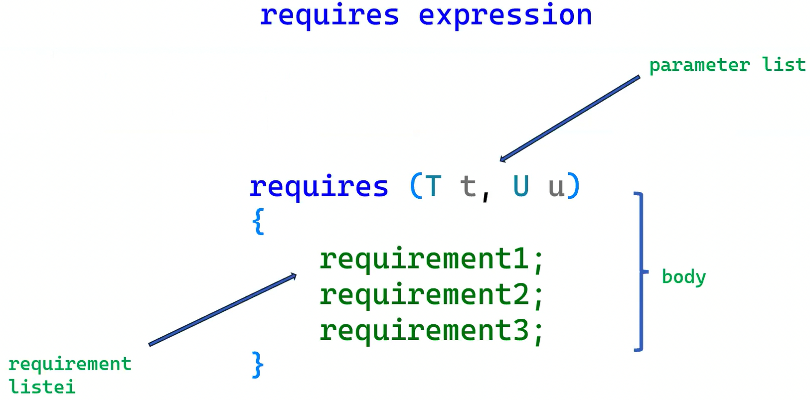
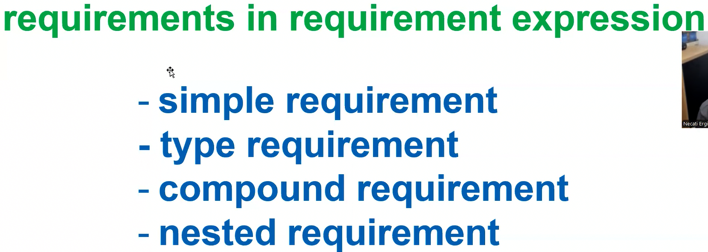

**Constraint (Kisitlama):** *template* parametrelerinin saglamalari gereken kosullari tanimlayan kod.

**Concept:** Isimlendirilmis, bir ya da birden fazla kisitlama.

Faydalari:

- Kodun daha kolay okunmasi ve yazilmasi (template parameterelerinin saglamasi gereken kosullarin arayuzde gorulmesi)
- Derleyicinin verdigi bulgu iletilerinin daha kisa ve daha anlasilir olmasi
- Derleme suresinin kisalmasi
- Template parametreleri için belirlenen kosullara bagli olarak yukleme (overloading) olanagi
- Kisitlamalarin standart bir yapiya kavusturulmasi

Conceptler soz konusu oldugunda 3 temel arac var:

- requires clause
- requires expression
- concept

> Concept'in kendisi bir template.

@00:12

SFINAE'de dogrudan mumkun olmayan, sinifin uye fonksiyonlarini constraint edebilme ozelligi var.

```cpp
#include <concepts>

template<typename T>
class Nec {
public:
    void foo() requires std::integral<T>
    {

    }
};
```

Yukaridaki kodda, `foo` fonksiyonunu template parametresi ile ilgili constraint edebiliriz. Conceptlerde eger constraint edilen fonksiyonlarsa ve constrainti saglamiyorsa overload-set'ten cikartilir.

```cpp
#include <concepts>
#include <iostream>

template<typename T>
class Nec {
public:
    void foo() requires std::integral<T>
    {
        std::cout << "integral\n";
    }
};

int main()
{
    Nec<double> dnec;
    // dnec.foo(); // Invalid.
    Nec<int> inec;
    inec.foo();
}

/*
    Out: 
    integral
*/
```

```cpp
#include <concepts>
#include <iostream>

template<typename T>
class Nec {
public:
    void foo() requires std::integral<T>
    {
        std::cout << "integral\n";
    }

    void foo()
    {
        std::cout << "other types\n";
    }
};

int main()
{
    Nec<double> dnec;
    dnec.foo();
    Nec<int> inec;
    inec.foo();
}

/*
    Out: 
    other types
    integral
*/
```

```cpp
#include <concepts>
#include <iostream>

template<typename T>
class Nec {
public:
    void foo() requires std::integral<T>
    {
        std::cout << "integral\n";
    }
    
    void foo() requires std::floating_point<T>
    {
        std::cout << "floating\n";
    }

    void foo()
    {
        std::cout << "other types\n";
    }
};

int main()
{
    Nec<double> dnec;
    dnec.foo();
    Nec<int> inec;
    inec.foo();
}

/*
    Out: 
    floating
    integral
*/
```

Uye fonksiyonlarin template parametresine bagli olarak constraint edilmesi:

```cpp
#include <iostream>
#include <ranges>
#include <vector>

template<typename T>
class ValOrColl {
	T value;
public:
	ValOrColl(const T& val) : value{ val } {}
	ValOrColl(T&& val) : value{ std::move(val) } {}
	void print() const
	{
		std::cout << value << '\n';
	}

	void print() const requires std::ranges::range<T>
	{
		for (const auto& elem : value) {
			std::cout << elem << ' ';
		}
		std::cout << '\n';
	}
	//...
};

int main()
{
	std::vector<int> ivec(5);
	ValOrColl x(ivec);

	x.print();

	ValOrColl<int> y(10);
	y.print();
}

/*
    Out: 
    0 0 0 0 0 
    10
*/
```

```cpp
#include <iostream>
#include <concepts>

template<typename T>
requires std::floating_point<T>
constexpr T pi = T(3.14159265782432322L);

int main()
{
    std::cout << pi<double> << '\n';
    // std::cout << pi<int> << '\n'; // Invalid.
}

/*
    Out: 
    3.14159
*/
```

```cpp
#include <iostream>
#include <concepts>
#include <set>

template<typename T>
requires std::integral<T>
using gset = std::set<T, std::greater<T>>;

int main()
{
    // gset<float> fset; //Invalid
    gset<int> iset; 
}
```

```cpp
#include <iostream>
#include <concepts>
#include <type_traits>

template<typename ...Args>
requires (std::is_integral_v<Args> && ...)
auto sum(Args ...args)
{
    return (args + ...);
}

int main()
{
    auto x = sum(1, 4L, 6u);
    // auto y = sum(1, 4L, 6u, 4.); Invalid
}
```

@00:31

#### `concept`

Isimlendirilmis *constraint* veya *constraint*ler kumesi. Concept'in kendisi bir template.

Concept tanimi: `concept` keyword ile baslar, `=`'in sag tarafina bir *boolean* sabit ifadesi yazilir.

```cpp
#include <concepts>
#include <type_traits>

template<typename T>
concept Pointer = std::is_pointer_v<T>;
```

Concept'lerin kullanilabilecegi yerler:
- Requires Clause'ta
- Template tur parametresi yerine concept ile constraint edecek sekilde bildirmek. (*Constrained template type parameter*)
- Abbreviated template syntax ile kullanimi
- Static If ile kullanilabilir.
- ...

```cpp
#include <iostream>
#include <concepts>
#include <type_traits>

template<typename T>
concept Pointer = std::is_pointer_v<T>;

template<typename T>
requires Pointer<T>
void foo(T x)
{
    // ...
}

int main()
{
    // foo(12); Invalid.
}
```

```cpp
#include <concepts>
#include <type_traits>

template<typename T>
concept Pointer = std::is_pointer_v<T>;

// Constrained template type parameter
template<Pointer T>
class Myclass {

};


int main()
{
    // Myclass<int> x; // Invalid.
    Myclass<int*> x;
}
```

```cpp
#include <concepts>
#include <type_traits>
/* 
    template<typename T, typename U>
    requires std::integral<T> && std::floating_point<U>
    auto foo(T x, U y)
    {
        return x + y;
    }
    
    Yukaridaki kullanim yerine su kullanim concept ile mumkun:
 */

 template<std::integral T, std::floating_point U>
auto foo(T x, U y)
{
    return x + y;
}


int main()
{
    foo(1, 4.5);
    // foo(2.3, 5); // Invalid.
}
```

```cpp
#include <concepts>
#include <type_traits>
/* 
    template<typename T>
    requires std::integral<T>
    auto foo(T x)
    {
        return x;
    }
    
    Yukaridaki kullanim yerine su kullanim concept ile mumkun:
 */

auto foo(std::integral auto x)
{
    return x;
}


int main()
{
    foo(1);
    // foo(2.3); // Invalid.
}
```

```cpp
#include <concepts>
#include <type_traits>

std::integral auto sum(std::integral auto x, std::integral auto y)
{
    return x + y;
}


int main()
{
    sum(1, 2);
    // sum(1.2, 3); // Invalid.
}
```

@00:53

Static If ile kullanimi:

```cpp
#include <iostream>
#include <concepts>
#include <type_traits>

template<typename T>
concept Pointer = std::is_pointer_v<T>;

template<typename T>
void foo(T x)
{
    if constexpr (Pointer<T>) {
        std::cout << "pointer\n";
    }
    else if constexpr (std::same_as<T, double>) {
        std::cout << "double\n";
    }
    else if constexpr (std::integral<T>) {
        std::cout << "integral\n";
    }
}

int main()
{
    foo(12);
    foo(1.2);

    int x = 57;
    foo(&x);
}

/*
    Out: 
    integral
    double
    pointer
*/
```

```cpp
#include <concepts>
#include <type_traits>

template<typename T>
concept ref_or_ptr = std::is_pointer_v<T> || std::is_reference_v<T>;

void foo(ref_or_ptr auto x)
{

}

int main()
{
    // foo(12); // Invalid.
    foo((int*)0);
}
```

```cpp
#include <concepts>
#include <type_traits>

void func(std::invocable<int> auto f, int x)
{
    f(x);
}

int main()
{
    func([](int x){ return x * x; }, 5);
}
```

```cpp
#include <iostream>
#include <concepts>
#include <type_traits>
#include <set>

template<std::integral T>
using gset = std::set<T, std::greater<T>>;

int main()
{
    // gset<double> dgset; // Invalid.
    gset<int> igset;
}
```

@01:03

#### Requires Expression

Requires expression is a boolean constant expression.

Eger template parametre-si/leri ustundeki kisitlamalar daha komplex, daha ozel kisitlamalarsa; dogrudan compile-time'da bir sabit ifadesi seklinde ifade edilemeyen ozel bir sentaks. Bir ya da birden fazla template parametresinin saglamasi gereken butun kosullari bir kume olarak ifade edebilmek.

- Bir ifadenin gecerli olmasi,
- Bir turun gecerli olmasi,
- Bir ifadenin turunun belirli bir constrainti saglamasi,
- Bir ifadenin yurutulmesi exception throw etmemesi,





```cpp
#include <concepts>
#include <type_traits>
#include <set>

template<typename T>
concept nec = requires(T p) {
    p == nullptr;
    *p;
    ++p;
    --p;
};

struct erg {
    int operator*()const;
    bool operator==(std::nullptr_t)const;
    erg& operator++();
    erg& operator--();
};

int main()
{
    static_assert(nec<int*>);
    static_assert(nec<erg>);
}
```

```cpp
#include <concepts>
#include <type_traits>
#include <set>

template<typename T>
concept nec = requires(T p) {
    std::integral<T>;
};

struct erg {
    
};

int main()
{
    static_assert(nec<erg>);
}
```

Yukaridaki kod gecerli. Simple requirement demek; bu ifadeyi yazmak gecerli olacak demek, ifadenin degeri `true` olacak demek degil.

```cpp
#include <concepts>
#include <type_traits>

template<typename T>
concept nec = requires(T p) {
    std::integral<T> {};
};

struct erg {
    
};

int main()
{
    // static_assert(nec<int>); Invalid.
}
```

Yukaridaki ifade ise gecerli bir ifade degil, bu turden bir nesne olusturulabilsin anlaminda.

```cpp
#include <concepts>
#include <type_traits>

template<typename T>
concept nec = requires(T p) {
    std::integral<T> && std::copyable<T>;
};

struct erg {
    
};

int main()
{
    static_assert(nec<int>);
}
```

Yukaridaki kodda `nec` kesinlikle `T` hem bir tam sayi olacak hem de kopyalanabilir olacak anlamina gelmiyor! Yalnizca o ifadelerin yazilmasi gecerli olacak anlaminda.

```cpp
#include <concepts>
#include <type_traits>

template<typename T>
concept nec = requires(T p) {
    ++p, --p, *p, p[3];
};

int main()
{
    static_assert(nec<int*>);
}
```

Yukaridaki sentaks tercih edilmeyecek olsa dahi gecerli.

```cpp
#include <iostream>
#include <concepts>
#include <type_traits>

template<typename T>
concept stream_insertable = requires(T x) {
    std::cout << x;
};

template<stream_insertable T>
void foo(T x)
{
    
}

struct nec{};

int main()
{
    foo(12);
    foo(std::string{});
    // foo(nec{}); // Invalid.
}
```

```cpp
#include <string>
#include <vector>
#include <concepts>
#include <type_traits>

template<typename C>
concept ElemsWritable = requires(typename C::value_type elem) {
    std::cout << elem;
};

template<ElemsWritable>
class Myclass {};

struct Nec{};

int main()
{
    Myclass<std::string> x;
    Myclass<std::vector<int>> y;
    // Myclass <std::vector<Nec>> z; // Invalid.
}
```

```cpp
template<typename T>
    requires requires(T x) { x.foo(); }
void func(T)
{

}

struct A { void foo(); };
struct B { };

int main()
{
    func(A{});
    // func(B{}); // Invalid.
}
```

```cpp
#include <iostream>

template<typename T>
void func(T)
{
    if constexpr (requires (T x) {++x;}) {
        std::cout << "ok\n";
    }
    else {
        std::cout << "not ok\n";
    }
}

struct A { void foo(); };

int main()
{
    func(A{});
    func(12);
}

/*
    Out:
    not ok
    ok
*/
```

```cpp
constexpr bool isprime(int x)
{
    if (x < 2) return false;
    if (x % 2 == 0) return x == 2;
    if (x % 3 == 0) return x == 3;
    if (x % 5 == 0) return x == 5;

    for (int i = 7; i * i <= x; i += 2) {
        if (x % i == 0) return false;
    }

    return true;
}

template <int N>
concept Prime = isprime(N);

template<int N>
requires Prime<N>
class Myclass {};

int main()
{
    Myclass<13> x;
    // Myclass<14> y; // Invalid.
}
```

```cpp
template<typename T, typename U>
concept Comparable = requires(T t, U u) {
    t < u;
    u < t;
    t == u;
    u == t;
};
```

```cpp
template<typename T, typename U>
concept addable_int = requires (T t, int x) {
    t + x;
    x + t;
};
```

```cpp
#include <type_traits>
#include <bit>

template<auto N>
concept PowerOfTwo = std::has_single_bit(static_cast<unsigned>(N));

template<int VAL>
requires PowerOfTwo<VAL>
class Buffer {};

int main()
{
    Buffer<4096> x;
    // Buffer<4097> y; // Invalid.
}
```

```cpp
#include <type_traits>

template<typename T>
concept int_or_double = std::is_same_v<T, int> || std::is_same_v<T, double>;

template<int_or_double auto N>
class Myclass{};


int main()
{
    Myclass<5> m1;
    // Myclass<5u> m2; // Invalid.
}
```

@02:11

##### Type Requirement

Bir turun olup olmadigi ya da oyle bir turun gecerli olup olmadigi sinanir.

`typename` keyword'u kullanmak mecburi.

```cpp
#include <vector>

template<typename T>
concept has_value_type = requires {
    typename T::value_type;
};

void foo(has_value_type auto x)
{
    
}

int main()
{
    foo(std::vector<int>{});
}
```

```cpp
template<typename T>
concept Container = requires (T x) {
    // Simple requirement:
    x.begin();
    x.end();
    // Type requirement:
    typename T::value_type;
    typename T::size_type;
    typename T::reference;
    typename T::pointer;
    typename T::difference_type;
    // ...
};
```

```cpp
template<std::integral T>
class Nec {};

template<typename T>
concept erg = requires {
    typename Nec<T>;
};

int main()
{
    static_assert(erg<int>);
    static_assert(!erg<double>);
}
```

```cpp
#include <utility>

template<typename C>
concept ctype = requires {
    typename C::value_type::first_type;
    typename C::value_type::second_type;
};

struct A {
    using value_type = int;

};

struct B {
    using value_type = std::pair<int, int>;

};

int main()
{
    static_assert(!ctype<A>);
    static_assert(ctype<B>);
}
```

```cpp
#include <type_traits>
#include <string>

template<typename T, typename U>
concept common = requires {
    typename std::common_type_t<T, U>;
};

template<typename T, typename U>
requires common<T, U>
class Myclass {};

int main()
{
    Myclass<int, char> x;
    // Myclass<double, std::string> y; // Invalid.
}
```

@02:28

##### Compound Requirement

Kume parantezi icinde bir ifade yazilir. Kume parantezinin icindeki ifadenin turunun saglamasi gereken constraint, kume parantezini takip eden `->` operatorunun sagina yazilir. Derleyici parantez icindeki ifadenin turunu, constraint'in 1. parametresine arguman olarak gecer.

> Simple requirement'tan farki, ifadenin kume parantezi icine yazilmasi.


```cpp
#include <type_traits>

template<typename T>
concept nec = requires(T x) {
    { x == x } -> std::same_as<bool>;
};
```

Yukaridaki kod icin, normalde `same_as`'in iki template parametresi var. Ancak parantezin icindeki tur 1. parametre olarak gecilir.

```cpp
template<typename T>
concept nec = requires(T x) {
    { x == x } noexcept;
};
```

Yukaridaki kodun anlami; parantez icindeki ifade gecerli olacak ve ifadenin yurutulmesi exception throw etmeme garantisi veriyor.

```cpp
#include <iterator>
#include <concepts>
#include <type_traits>

template<typename T>
concept ContainerLike = requires(T a) {

    typename T::value_type;
    typename T::iterator;
    typename T::size_type;

    { a.begin() } noexcept -> std::same_as<typename T::iterator>;
    { a.end() } noexcept -> std::same_as<typename T::iterator>;

        requires requires (typename T::iterator it) {
            { *it } -> std::same_as<typename T::value_type>; // Dereference erisimi
            { ++it } -> std::same_as<typename T::iterator&>; // pre-increment
            { it != a.end() } -> std::convertible_to<bool>;  // Karsilastirma
        };
};

int main()
{
    
}
```

Yukaridaki ornek soraki derste daha detayli anlatilacak.